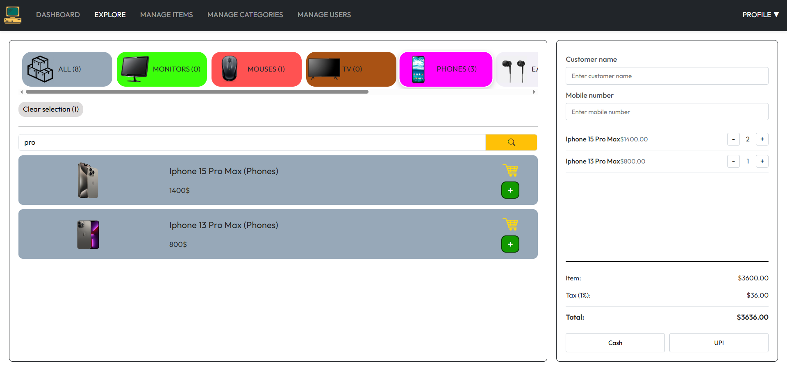
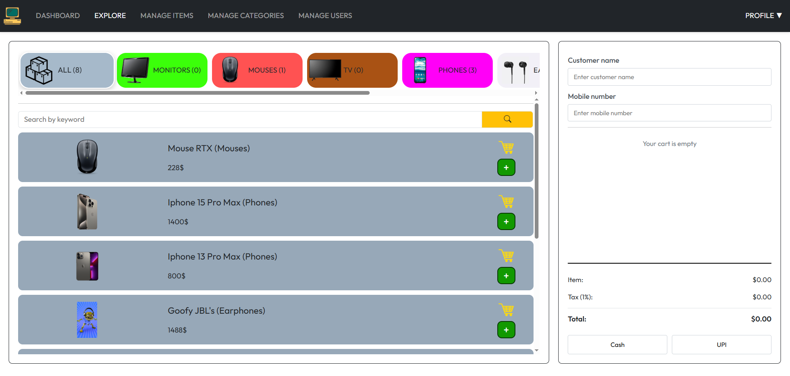
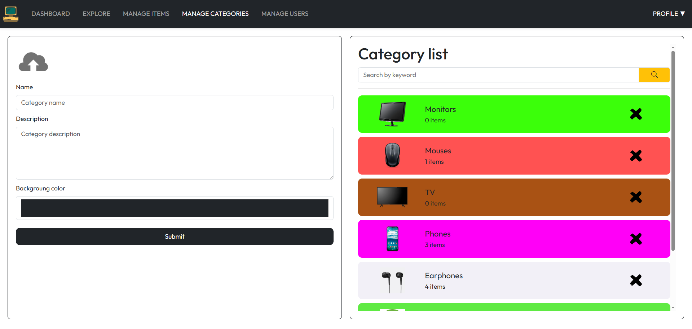
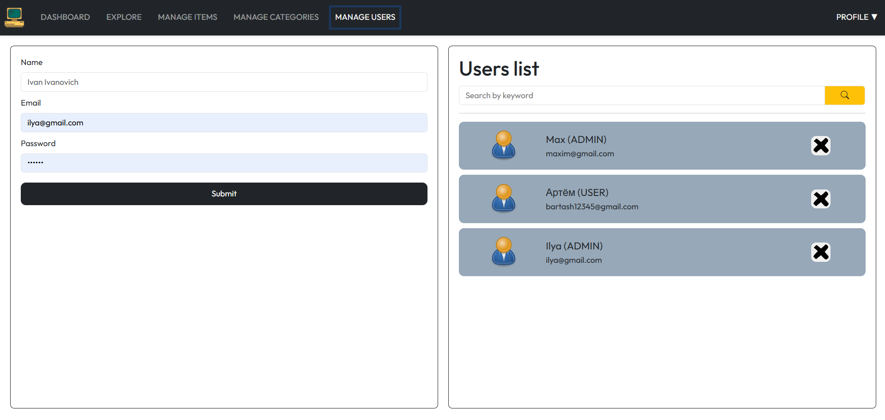
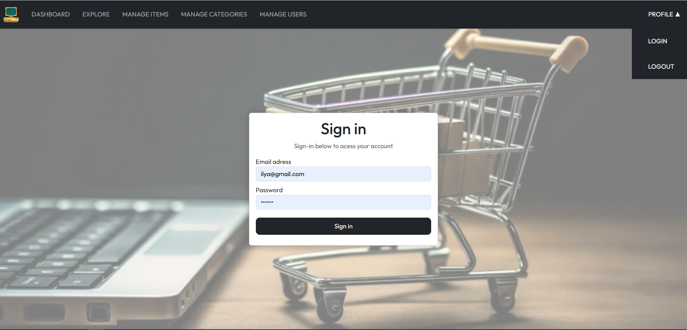

# 📊 Billing Software - Система Управления Торговлей



## 🌟 О проекте

Billing Software - это современное веб-приложение для управления товарами, категориями и продажами в розничной торговле. Проект включает:

- 📦 Управление товарами и категориями
- 🛒 Функциональную корзину покупок
- 👥 Управление пользователями
- 🔐 Систему авторизации и ролей

## 🛠 Технологический стек

### Frontend

- **React** 19.1.0 (функциональные компоненты, хуки)
- **React Router** 6 для навигации
- **Context API** для управления состоянием
- **Axios** для HTTP-запросов
- **React Hot Toast** для уведомлений
- **Bootstrap** + кастомные CSS для стилей (подключен, но почти не используется)

### Backend

- **Spring Boot** (Java)
- **Spring Security** с JWT аутентификацией
- **Hibernate** + **MySQL** для работы с данными
- **Lombok** для сокращения boilerplate кода

## 🚀 Возможности

### Для администраторов

- 🔧 Полное управление товарами и категориями
- 👥 Регистрация новых пользователей

  можно добавить:

- 📈 Просмотр аналитики продаж
- 💳 Поддержка разных способов оплаты
- 📄 Печать чеков

### Для покупателей

- 🏷 Просмотр товаров с фильтрацией
- 🔍 Поиск товаров по категориям и названию
- 🛒 Удобная корзина покупок
- 📱 Адаптивный интерфейс

## 🖥 Скриншоты интерфейса

|  |  |
| --------------------------------------- | ---------------------------------------------------------- |
| _Главный экран приложения_              | _Выбранные товары в корзину_                               |

|  |  |
| ------------------------------------- | ------------------------------------------ |
| _Менеджер товаров_                    | \_Менеджер категорий                       |

|  |  |
| ------------------------------------------- | ----------------------------------- |
| \_Менеджер пользователей                    | _Страница входа_                    |

## 🛠 Установка и запуск

### Требования

- Node.js 16+
- Java 17+
- MySQL

### Frontend

```bash
git clone https://github.com/IlyaKukharchuk/Billing-Software.git
cd billing-software/frontend
npm install
npm run dev
```

### Backend

```bash
cd backend
./mvnw spring-boot:run
```

## 📂 Структура проекта

```
billing-software/
├── frontend/               # React приложение
│   ├── public/             # Статические файлы
│   ├── src/                # Исходный код
│   │   ├── assets/         # Изображения и иконки
│   │   ├── components/     # UI компоненты
│   │   ├── context/        # Контексты приложения
│   │   ├── css/            # Стили
│   │   ├── pages/          # Страницы приложения
│   │   ├── service/        # API сервисы
│   │   └── App.js          # Главный компонент
├── backend/                # Spring Boot приложение
│   ├── src/main/java/
│   │   ├── config/         # Конфигурации
│   │   ├── controller/     # REST контроллеры
│   │   ├── entity/         # Сущности БД
│   │   ├── exceptions/     # Кастомные исключения + GlobalExceptionHandler
│   │   ├── filters/        # Фильтры запросов
│   │   ├── io/             # DTO для запросов и ответов
│   │   ├── repository/     # Репозитории
│   │   ├── service/        # Бизнес-логика
│   │   └── utl/            # Утилитные классы
└── README.md               # Этот файл
```

## 📜 Лицензия

Этот проект распространяется под лицензией MIT. Подробнее см. в файле [LICENSE](LICENSE).
